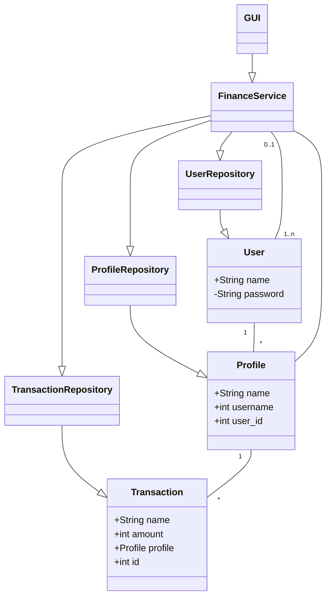
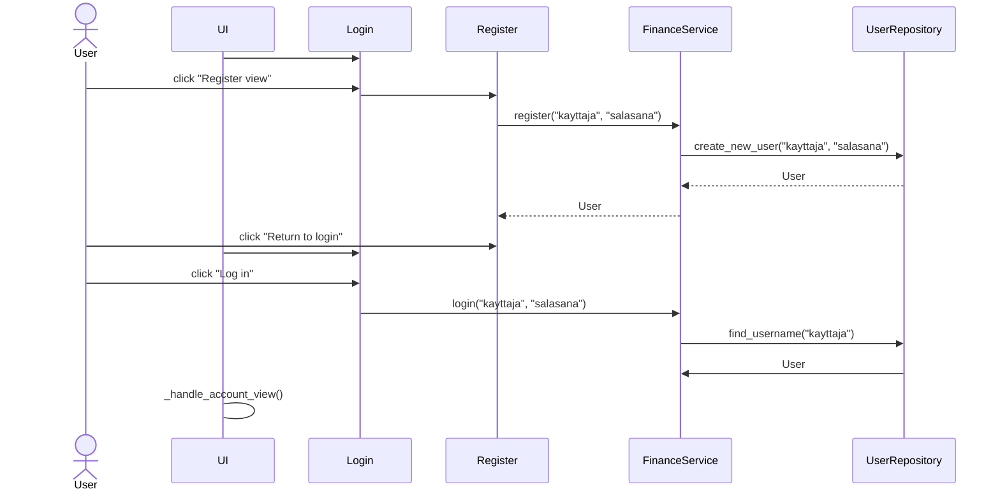
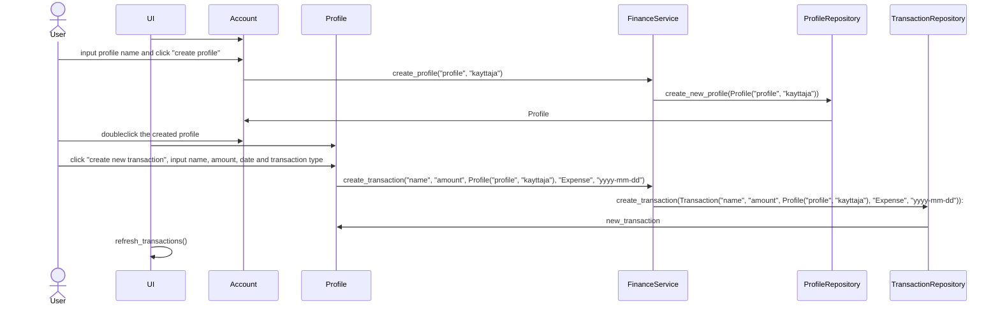

# Arkkitehtuuri
## Luokkarakenne

## Tietojen tallennus
Tiedot tallennetaan omiin tietokantatauluihin sqlite-tietokantaan.
Tilitapahtuman noudattaa rakennetta:
```
Tilitapahtuma:
    <tunniste>
    <nimi>
    <määrä>
    <tyyppi>
    <päivämäärä>
    <profiilitunniste>
```

## Pääasialliset toiminnallisuudet

### Käyttäjän luonti ja kirjautuminen


Käyttäjä syöttää haluamansa käyttäjänimi-salasana parin, jonka arvot välitetään FinanceService käsittelijälle joka välittää nämä eteenpäin UserRepository-luokkaan, joka suorittaa tarvittavat tietokantaoperaatiot.
Vastaavassa luokassa `login()`-funktio käsittelee käyttäjänimi-salasana parin ja palauttaa istunnolle `User`-instanssin.

### Profiilin avaus ja tilitapahtuman luonti

Käyttäjän syötettyä tarvittavat arvot välittää `FinanceService`-luokka ne eteenpäin `TransactionRepository`-luokalle joka suorittaa tilitapahtuman lisäykseen tietokantaoperaatiot, joka palauttaa tapahtuman. 
Palautetun tapahtuman tiedot päivitetään `refresh_transactions()`-funktion kautta graafiselle taulukko-komponentille.

### Muut toiminnot
Tapahtuman muokkaaminen etenee pääasiallisesti samantapaisesti tilitapahtuman lisäys, mutta annetuissa parametreissa välitetään olemassa olevan tilitapahtuman tunniste, tapahtuman poistaminen etenee myös välittämällä tämä tunniste.

Sijoitustuottolaskurin käyttö perustuu liukuvalitsimien arvoihin, jotka välitetään erilliselle `calculate_investments` funktiolle.