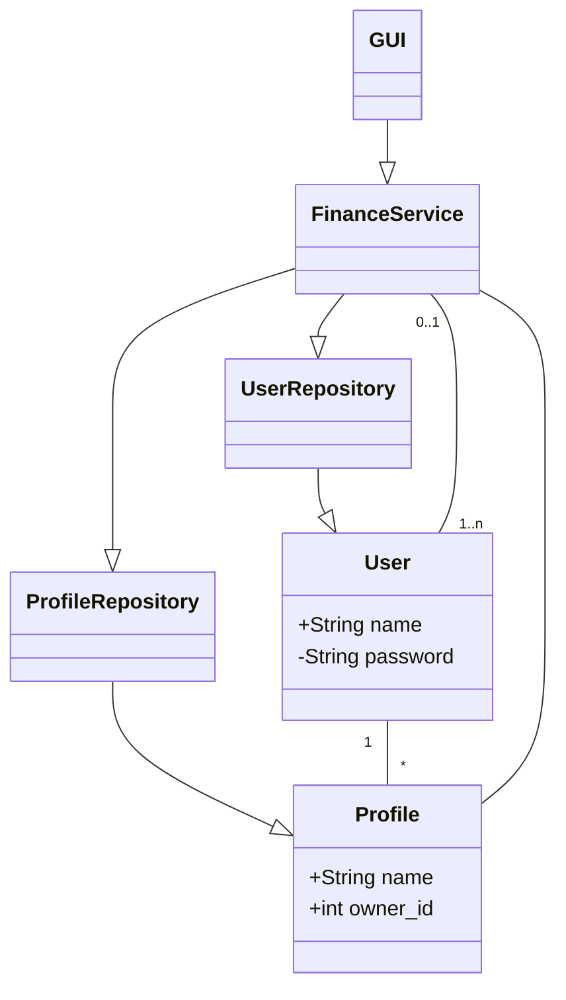

# Arkkitehtuuri

```mermaid
classDiagram
    GUI --|> FinanceService
    FinanceService --|> ProfileRepository
    FinanceService --|> UserRepository
    UserRepository --|> User
    ProfileRepository --|> Profile
    Profile -- FinanceService
    User "1" -- "*" Profile
    FinanceService "0..1" -- "1..n" User

    class User {
        +String name
        -String password
    }
    class Profile {
        +String name
        +int owner_id
    }

```