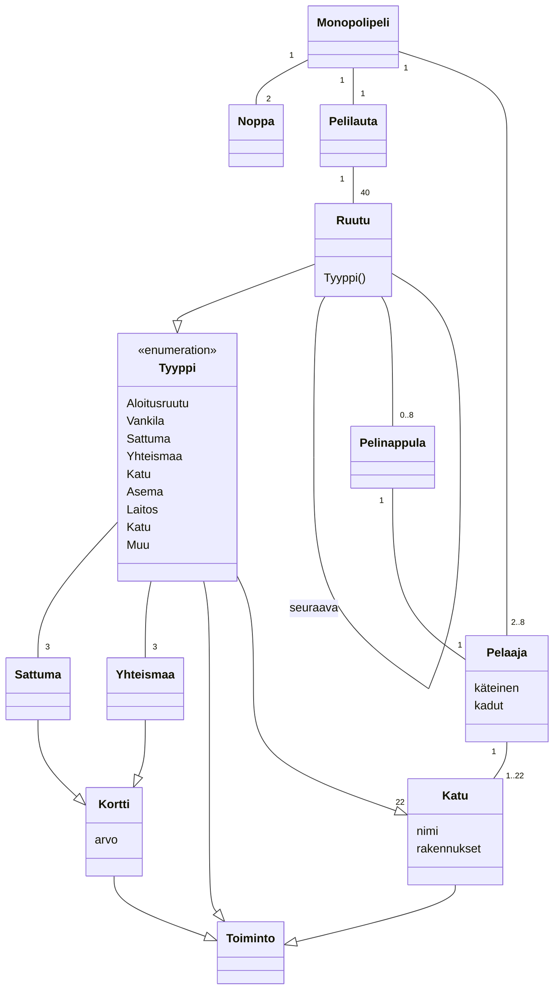

```mermaid
 classDiagram
    Monopolipeli "1" -- "2" Noppa
    Monopolipeli "1" -- "1" Pelilauta
    Pelilauta "1" -- "40" Ruutu

    Ruutu --|> Tyyppi

 
    Pelaaja "1" -- "1..22" Katu

    Tyyppi -- "3" Sattuma
    Tyyppi -- "3" Yhteismaa
    Sattuma --|> Kortti
    Yhteismaa --|> Kortti
    Tyyppi --|> Toiminto
    Kortti --|> Toiminto
    Katu --|> Toiminto
    Tyyppi --|> "22" Katu
    
    Ruutu -- Ruutu : seuraava
    Ruutu -- "0..8" Pelinappula
    Pelinappula "1" -- "1" Pelaaja
    Pelaaja "2..8" -- "1" Monopolipeli
    
    class Kortti {
        arvo
    }
    class Ruutu {
        Tyyppi()
    }
    class Pelaaja {
        käteinen
        kadut
    }
    class Katu {
        nimi
        rakennukset
    }
    class Tyyppi {
        <<enumeration>>
        Aloitusruutu
        Vankila
        Sattuma
        Yhteismaa
        Katu
        Asema
        Laitos
        Katu
        Muu
    }
```